
# COMP2150  - Level Design Document
### Name: Bryan Zhang
### Student number: 47393068 

This document discusses and reflects on the design of your platformer level for the Level Design assessment. It should be 1500 words. Make sure you delete this and all other instructional text throughout the document before checking your word count prior to submission. Hint: You can check word count by copying this text into a Word or Google doc.

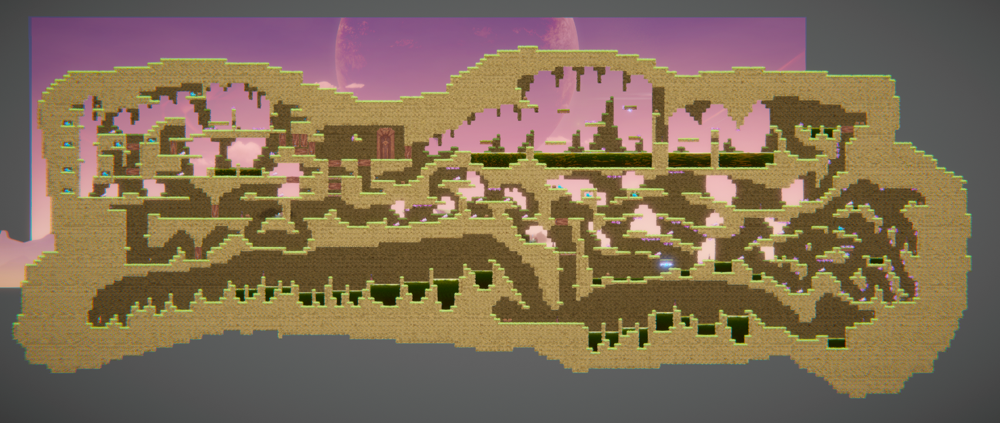
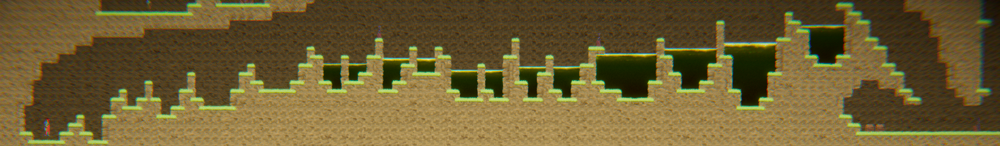
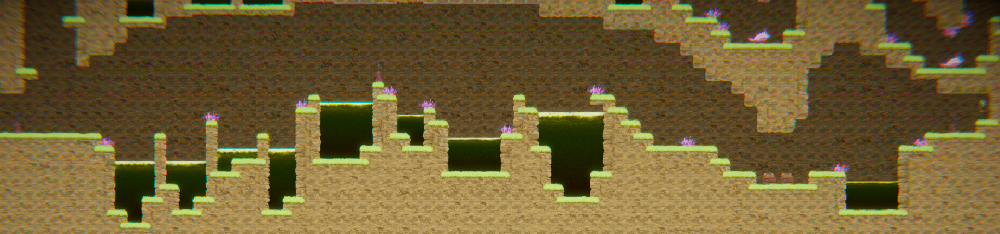
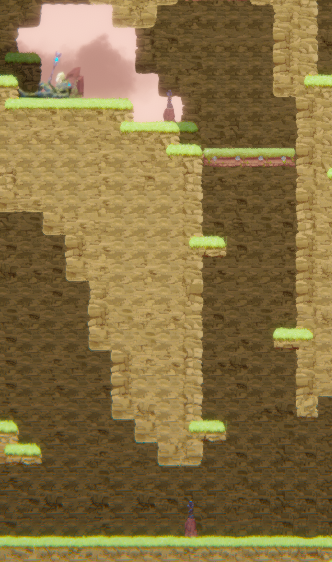
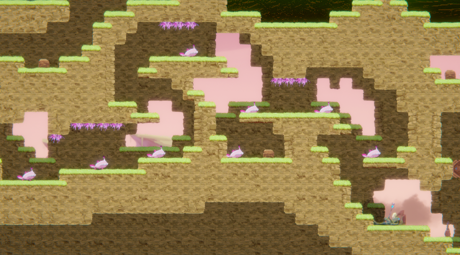
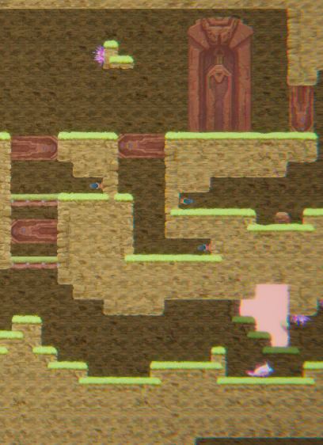
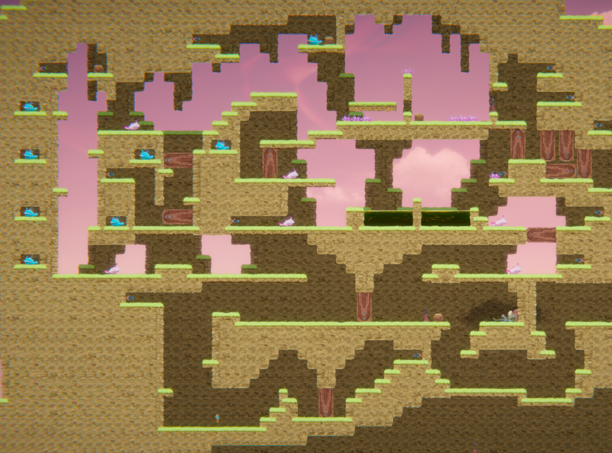
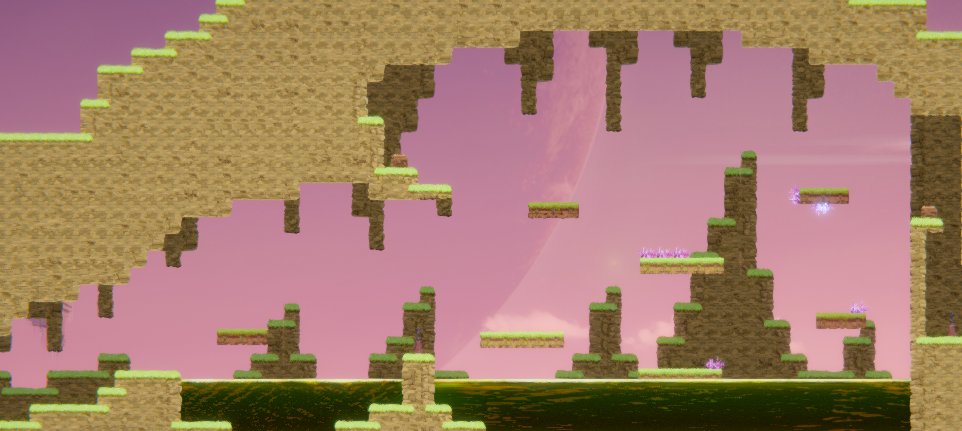
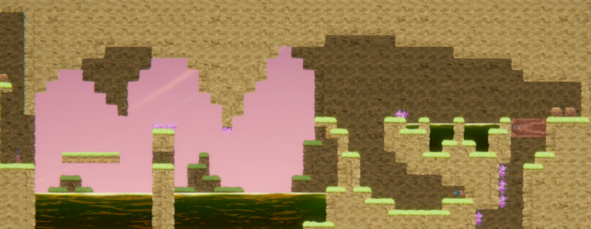
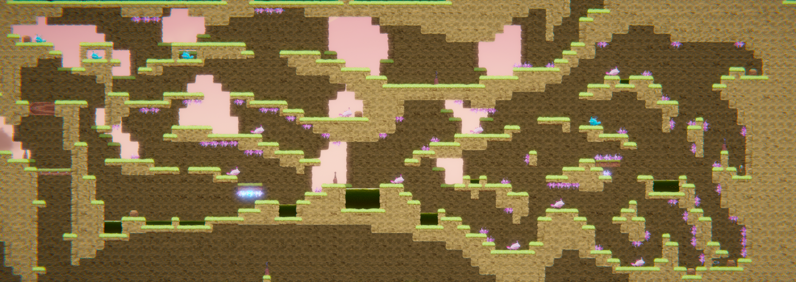

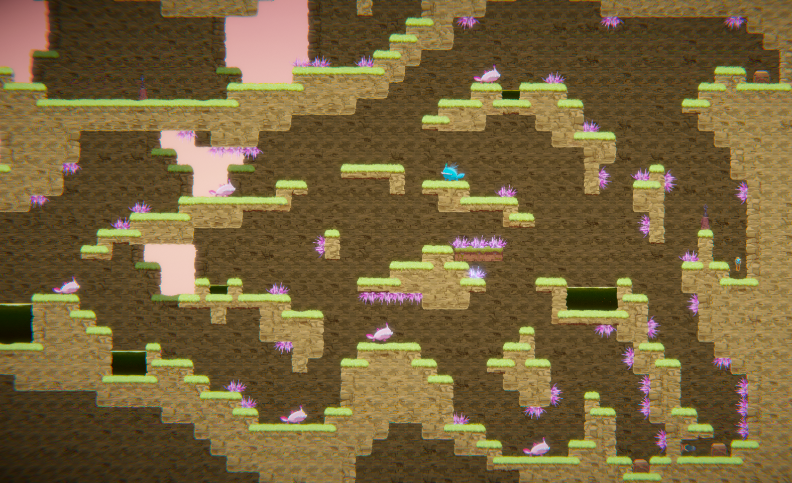

## 1. Player Experience (~700 words)
Outline and justify how your level design facilitates the core player experience goals outlined in the assignment spec. Each section should be supported by specific examples and screenshots of your game encounters that highlight design choices made to facilitate that particular experience.

### 1.1. Discovery
What does the player learn? How does your encounter and broader level design facilitate learning in a way that follows good design practice?
For section one, The player learns about the jump mechanic. This knowledge is required because section one is a simple form of parkour with hazardous acid to jump over. If the player touches the acid, they will respawn back at the beginning or at any checkpoints the player has reached. The section starts off with small gaps of acid between each platform so that the player can easily get familiar with the controls. As they progress, the platforms will be wider apart. This is shown in example one where the player does not jump far enough and falls into the acid pit. This will engage the player to learn that holding down spacebar will increase the player's jump height, resulting in more distance covered. There are also healthboxes underneath the first part of section one should the player take any damage. After that, players can then choose to start section two or continue forward to get the key.

For section two, the player will encounter the staff weapon pickup. This entices them to understand that there will be chompers nearby and must use the staff to get rid of them. Players can also attempt to jump over the chompers, but then they will encounter spikes. Spikes are introduced in the second level as an extra obstacle for the players to avoid while battling chompers. Players will be punished for jumping over chompers in certain areas where there are spikes above them. After players complete the first part of section two, they will find the gun weapon. This will entice them to use the gun on nearby chompers, but also trigger switches as they are the only method to open doors. Thus, they will go and find which switches open up to the key door room and/or the key.

Section three is a combination of both section one and two. After players complete the moving platform part, they will have to navigate through a tunnel-like environment full of obstacles and enemies. There is also a door that causes a loopback encounter. It is optional to open but will still encourage players to go look for the switch since it saves time to go back to the key door room. 

### 1.2. Drama
What is the intensity curve? How does your design facilitate increasing yet modulating intensity, with moments of tension and relief?

For my level, I have structured my sections so that there is relief when obtaining a health box and is easier to collect

### 1.3. Challenge
What are the main challenges? How have you designed and balanced these challenges to control the difficulty curve and keep the player in the flow channel?

In section 1, the main challenge is navigating to the end of the parkour without dying. It is testing the player's knowledge of the jump and movement controls. The difficulty is increased as the player progresses throughout the section by increasing the distance between platforms so that they would need to time their long jumps perfectly or else they will fall into acid. Also, there is a checkpoint right before the key in section one, shown in s1PartB.png. This checkpoint prevents the player from deliberately falling into the acid to teleport back to the beginning of the parkour section. Instead, players must go back the way they came from.
- Section 2
For section two, the main challenge is opening the four mini-doors that lead to the key door room. I have carefully placed switches in areas where the player must use the gun weapon to shoot them. These switches are placed around section two. Some switches are behind more mini-doors, some require dodging spitter venom and some require jumping over spikes. 
- Section 3
navigating through platforms through a tunnel-like underground environment while avoiding enemies and obstacles
finding the switch to activate the door
- Keys
I have placed each key in a specific location of each section that requires the player to explore further should they choose to skip its path. I have placed areas where players can choose their own path to go through.  

### 1.4. Exploration
How does your level design facilitate autonomy and invite the player to explore? How do your aesthetic and layout choices create distinct and memorable spaces and/or places?
The level has different paths to take, allowing decision making available for the player. For example, after completing the first half of section one, players can either progress to section two or continue on finding the key in section one. This is shown in example two. Section three also promotes exploration as the player can take various paths to navigate around the level. The red arrows in example 2.1 determines the possible paths the player can take starting after the acid pool after the checkpoint.

## 2. Core Gameplay (~400 words)
A section on Core Gameplay, where storyboards are used to outline how you introduce the player to each of the required gameplay elements in the first section of the game. Storyboards should follow the format provided in lectures.

Storyboards can be combined when multiple mechanics are introduced within a single encounter. Each section should include a sentence or two to briefly justify why you chose to introduce the mechanic/s to the player in that sequence.

- Acid is used in the first section of the level. Using parkour-like gameplay elements, it allows the player to learn and utilise the jumping mechanic. As they get familiar and complete section one, I have acid pools reoccuring in sections two and three.

- Checkpoints are in place for stress relief and saving the player's time to redo specific areas of sections.

- Health pickups are placed in safe areas but some are more difficult to obtain. They may be guarded by spikes or enemies.

- I have one key in each section. The second key can be viewed from the early parts of the first section. This is to allow players to memorise the location of the keys so they know what to look for when they are close to it. The location of each key are in areas which can be easily skipped. This is to promote exploration of the player when they navigate throughout each section.

### 2.7. Passthrough Platforms
- Passthrough platforms are first encountered right before the first checkpoint of section two. Positioned directly under the trigger door for section three, its only usage is to catch players falling from the trigger door. This will prevent players from falling all the way down the vertical corridor.

- I have placed this at the beginning of the second section so that players now know they must use this weapon to kill the chompers. 

- Chompers are first encountered in the second section. They are placed after the staff weapon pickup so that the player understands they need to interact with the staff to kill off chompers.

- Spikes are first introduced in the second phase. They add an extra layer of stress for the chompers and moving platforms.

### 2.6. Moving Platforms

### 2.9. Spitters
- Spitters are first introduced in the second section. Most are hidden in walls, unable to take damage so that the player are forced to dodge its green venom or else result in taking damage.

## 4. Iterative Design (~400 words)
Reflect on how iterative design helped to improve your level. Additional prototypes and design artefacts should be included to demonstrate that you followed an iterative design process (e.g. pictures of paper prototypes, early grey-boxed maps, additional storyboards of later gameplay sequences, etc.). You can also use this section to justify design changes made in Unity after you drew your level design maps shown in section 3. 

You should conclude by highlighting a specific example of an encounter, or another aspect of your level design, that could be improved through further iterative design.

I wanted to originallly follow the traditional process of 3 levels sequentially in order while making shortcuts to enter areas encountered beforehand. The iterative design process aided this by allowing me to continuously test each section and making sure they are equally connected. I have also make some changes in my final level sections that are not in my original sketches. For example, for section three, instead of a door and a switch, I was originally going to use a one-way platform. I wanted a way to make the player unable to jump back up without making the gap significantly tall. This is because I wish to design the level so that the player does not need to go back to complete section three. That is when the door comes into play. There were meant to be spikes in the second part of section one but I have removed them in my final design because I considered adding spikes will not make the section easy anymore. I originally wanted the player to see the section three key when obtaining section one key. This was later changed due to the addition of switches and doors. Moving platforms were also added in section three but were not in my original design. I added them to make section three more harder.

## Generative AI Use Acknowledgement

Use the below table to indicate any Generative AI or writing assistance tools used in creating your document. Please be honest and thorough in your reporting, as this will allow us to give you the marks you have earnt. Place any drafts or other evidence inside this repository. This form and related evidence do not count to your word count.
An example has been included. Please replace this with any actual tools, and add more as necessary.

### Tool Used: ChatGPT
**Nature of Use** Finding relevant design theory.

**Evidence Attached?** Screenshot of ChatGPT conversation included in the folder "GenAI" in this repo.

**Additional Notes:** I used ChatGPT to try and find some more relevant design theory that I could apply to my game. After googling them, however, I found most of them were inaccurate, and some didn't exist. One theory mentioned, however, was useful, and I've incorporated it into my work.

### Tool Used: Example
**Nature of Use** Example Text

**Evidence Attached?** Example Text

**Additional Notes:** Example Text

