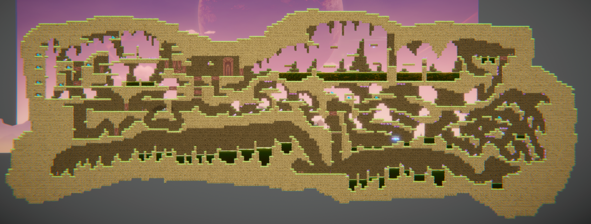

# COMP2150  - Level Design Document
### Name: Bryan Zhang
### Student number: 47393068 

For section one, The player learns about the jump mechanic. This knowledge is required because section one is a simple form of parkour with hazardous acid to jump over. The section starts off with small gaps of acid between each platform so that the player can easily get familiar with the controls. As they progress, the platforms will be wider apart. This is shown in the left image of "Example 1" where the player does not jump far enough and falls into the acid pit. This will engage the player to learn that holding down spacebar will increase the player's jump height, resulting in more distance covered. After that, players can then choose to start section two or continue forward to get the key. The spikes shown in "Section 1 part b" are introduced to create a variation of the parkour that the player previously completed. For section two, the player will encounter the staff weapon pickup. This entices them to understand that there will be chompers nearby and must use the staff to get rid of them. Players can also attempt to jump over the chompers but the spikes will punish, them shown in "Section 2 part a". After players complete the first part of section two, they will find the gun weapon. Similar to the staff, this informs players for upcoming enemies, but also trigger switches as they are the only method to open doors. Thus, they will go and find which switches open up to the key door room and/or the key. Some switches are behind more doors, some require getting past enemies and some require jumping over spikes. Section three is a combination of both section one and two. In section three, players must memorise everything they have learnt from the previous two sections to explore it fully. It starts off with a small parkour with moving platforms, adding yet another variation of the first section. Then they will navigate through a large complex variant of the first part of section two.

For section one, intensity happens more in the 2nd part of section one. The spikes pressure the player as they have to position themselves more carefully. This is highlighted in "Example 4" where the player has to assume the hitboxes of spikes are not that wide. There are also healthboxes underneath the first part of section one should the player take any damage. For section two, intensity happens most in the vertical pathway with the enclosed spitters. Since their venom can shoot through walls, players must quickly dodge them to shoot the switch above or navigate to the path below. Healthboxes are placed in more random places (ie. under the moving platform and above the spitter tower in "Section 2 part c"). For section three, intensity happens mostly in the final part where the player has to navigate through obstacles and enemies. Healthboxes are fairly easy to get, however some intimidate the player with spikes.

In section 1, the main challenge is navigating to the end of the parkour without dying. It is testing the player's knowledge of the jump and movement controls. The difficulty is increased as the player progresses throughout the section by increasing the distance between platforms so that they would need to time their long jumps perfectly or else they will fall into acid. Also, there is a checkpoint right before the key in section one, shown in "Section 1 part b". This checkpoint prevents the player from deliberately falling into the acid to teleport back to the beginning of the parkour section. Instead, players must go back the way they came from. For section two, the main challenges is opening the four doors that guard the key door room. Since all doors and switches appear identical, players will not always memorise the connection between every door and switch. Some switches will trigger doors outside of player's camera screen. "Example 3" highlights all switch and door connections. Another challenge is getting past the spitters. Almost all spitters in section two are trapped into the foreground tiles to make them invincible, shown in "Section 2 part c". This forces the player to dodge their venom as it can traverse through the foreground tiles. This is balanced with the fact that almost all other switches are fairly easy to shoot. For section three, the main challenge is finding the switch to activate the door while navigating through a labyrinth. The labyrinth has various obstacles and enemies which the player must avoid. The door is a loopback encounter that leads near the staff pickup. Since players cannot physically go back to the key door room via moving platform parkour, it forces players to go look for the switch. The red arrows in "Example 2.1" determines the possible paths the player can take starting after the acid pool after the checkpoint. There is also a checkpoint before the key so that players cannot die to respawn back at the acid pit checkpoint. However, it is a fairly small part of section three, so players can easily memorise the way back to the door.

### 1.4. Exploration
How does your level design facilitate autonomy and invite the player to explore? How do your aesthetic and layout choices create distinct and memorable spaces and/or places?

The level features loopbacks to encourage players to use for increased map navigation efficiency. After opening all four doors to the key door room, players can choose to open the door to section three or complete a small puzzle to unlock a loopback that leads near the gun pickup.

Acid is used in the first section of the level. Using parkour-like gameplay elements, it allows the player to learn and utilise the jumping mechanic. As they get familiar and complete section one, I have acid pools reoccuring in sections two and three. Spikes are first introduced in the first section. They add an extra obstacle in the parkour that players must avoid. Checkpoints are in place for stress relief and saving the player's time to redo specific areas of sections. Health pickups are placed in safe areas but some are more difficult to obtain. They exist to aid the player when they struggle and lose health points. I have one key in each section. The second key can be viewed from the early parts of the first section. This is to allow players to memorise the location of the keys so they know what to look for when they are close to it. The location of each key are in areas which can be easily skipped. This is to promote exploration of the player when they navigate throughout each section. Passthrough platforms are first encountered right before the first checkpoint of section two. Positioned directly under the trigger door for section three, its only usage is to catch players falling all the way down the vertical corridor from the door and climb up easier for the key door room. I have placed this at the beginning of the second section so that players now know they must use this weapon to kill the chompers. Chompers are first encountered in the second section. They exist primarily of the staff pickup. Moving platforms are first shown in section two but is used more in section three. They add variance to section one's parkour stage. Spitters are first introduced in the second section. They are used as "turrets" and to pose a large threat to the player.

I wanted to originallly follow the traditional process of 3 levels sequentially in order while making shortcuts to enter areas encountered beforehand. The iterative design process aided this by allowing me to continuously test each section and making sure they are equally connected. I have also make some changes in my final level sections that are not in my original sketches. Instead of a door and a switch, I was originally going to use a one-way platform for the final part of section three. I wanted a way to make the player unable to jump back up without making the gap significantly tall. This is because I wish to design the level so that the player does not need to go back to complete section three. That is when the door comes into play. I originally wanted the player to see the section three key when obtaining section one key. This was later changed due to the addition of switches and doors. Moving platforms were also added in section three but were not in my original design. I added them as an extra obstacle. Looking back at section two, I could have added a combination of boxes and pressure plates to open doors, not just switches. This allows one door or multiple doors to open for a specific amount of time and then close back. The addition of pressure plates increases challenge, discovery and exploration in section two as players will now have to find new ways to open doors.

## Generative AI Use Acknowledgement

Use the below table to indicate any Generative AI or writing assistance tools used in creating your document. Please be honest and thorough in your reporting, as this will allow us to give you the marks you have earnt. Place any drafts or other evidence inside this repository. This form and related evidence do not count to your word count.
An example has been included. Please replace this with any actual tools, and add more as necessary.

### Tool Used: N/A I did not use any AI tools
**Nature of Use** Example Text

**Evidence Attached?** Example Text

**Additional Notes:** Example Text

